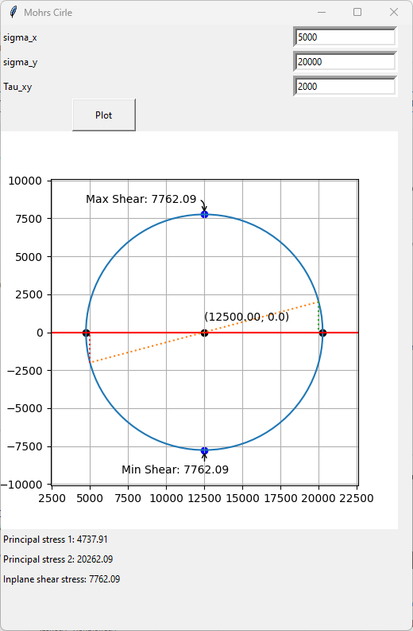

# Mohr's Circle

2D Mohrs Circle GUI through Tkinter and matplotlib. Plots Mohr's circle based on dynamically inputted normal stresses on the x and y axis, along with shear stress.



## Installing 

First and foremost, if you are not experienced with code It is HIGHLY reccomended to ask ChatGPT to walk you through getting started. coders made it, so as a result it is very good at walking newcomers through the steps to use it. 

If you are new to coding and would like to use this 
- Download Python -- https://www.python.org/downloads/ 
- Download VSCODE -- https://code.visualstudio.com/Download
    or equivalent IDE, I would highly reccomend VSCODE if you are not sure which one to use.

You will need to download the matplotlib library  for python. 
to do this on windows:
- press the windows key and click on the search bar. search "terminal" and type the following in the command prompt: 

```bash
$ pip install Matplotlib
```

open the program file on VSCODE and run. If you are a newcomer you may find this scary; their are plenty of videos online for this, however, if you need help. As mentioned before; ChatGPT is good for this part, also. 

### Future Plans: 
 
if this project were to be worked on more, the dream is to: 
    - add 3D Mohrs
    - add Yield strengths and factors of safety 
    - add Elements below Mohr's CIRCLE.
